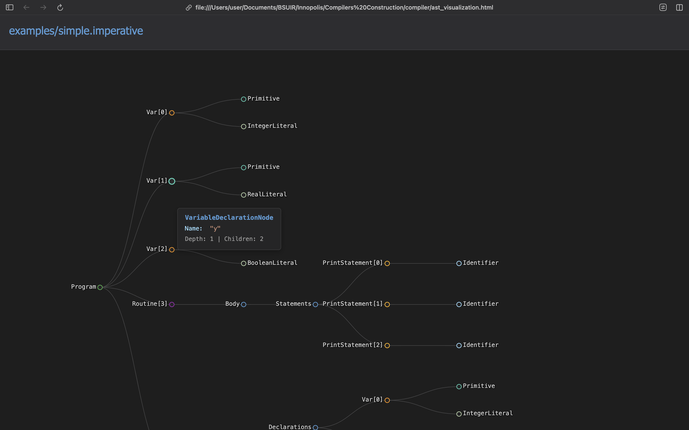

# Presentation

## Team
Our team is **Tourists**
Team members are **Danila Khrankou & Tsimafei Kurstak**

## Impementation
Language: **ProjectI (Imperative)**
Implementation language: **C#**
Tool: **gppg-based parser**
Target platform: **WASM**

### AST nodes
We described our abstract AST nodes and concrete nodes
```csharp
public abstract class AstNode
{
    public int Line { get; set; }
    public int Column { get; set; }
}
public abstract class DeclarationNode : AstNode
{
}
public abstract class TypeNode : AstNode
{
}
public abstract class StatementNode : AstNode
{
}
public abstract class ExpressionNode : AstNode
{
}
```

### The main trouble
Since we need to work with GPPG-based parsers, we need to use GPLEX in our case. However, we're all writing our own lexers. This creates a problem: GPPG requires GPLEX, which our project doesn't have. Therefore, we needed to write an adapter.

```csharp
internal class LexerAdapter : AbstractScanner<object, Compiler.Parser.LexLocation>
{
    private readonly LexerClass _lexer;
    private Token _currentToken;

    private static readonly Dictionary<TokenType, int> TokenMap = new()
    {
        { TokenType.tkIntegerLiteral, (int)Tokens.tkIntegerLiteral },
        { TokenType.tkRealLiteral, (int)Tokens.tkRealLiteral },
        { TokenType.tkBoolLiteral, (int)Tokens.tkBoolLiteral },
        { TokenType.tkIdentifier, (int)Tokens.tkIdentifier },
        { TokenType.tkVar, (int)Tokens.tkVar },
        ...
    }
    ...
}
```

As you can see here we working with **INTERNAL CLASS**. We just cannot use it. We need another one adapter:>
```csharp
public class ParserFacade
{
    ...
    public ProgramNode Parse()
    {
        var adapter = new LexerAdapter(_lexer);
        var parser = new Parser(adapter);

        if (!parser.Parse())
        {
            throw new ParseException("Parsing failed");
        }

        return parser.Result!;
    }
}
```

Is it all, right? No, it isn't. In the previous presentation we already show you a Span class. But it sucks. We need another one implementing the interface
```csharp
public class LexLocation : QUT.Gppg.IMerge<LexLocation>
...
```

And all this just for the sake of making our home-made lexer friends with the gppg.

### Grammar rules
```yacc
Program
    : DeclarationList
        {
            Result = new ProgramNode { Declarations = (List<DeclarationNode>)$1 };
            $$ = Result;
        }
    | /* empty */
        {
            Result = new ProgramNode();
            $$ = Result;
        }
    ;

DeclarationList
    : Declaration
        {
            $$ = new List<DeclarationNode> { (DeclarationNode)$1 };
        }
    | DeclarationList Declaration
        {
            var list = (List<DeclarationNode>)$1;
            list.Add((DeclarationNode)$2);
            $$ = list;
        }
    ;

Declaration
    : VariableDeclaration
    | TypeDeclaration
    | RoutineDeclaration
    ;
```

### Debug mode output example
Run the compiler with `--debug` to see tokens and a detailed AST. Example on `examples/simple.imperative`:

```bash
./release/Compiler examples/simple.imperative --debug
```


Example of code:
```pascal
var x : integer is 42
var y : real is 3.14
var flag : boolean is true
routine main() 
is
    print x
    print y
    print flag
end

routine test(): integer
is
    var z : integer is 30
    var result : integer
    result := z * 24 + 39 - 98
    return result
end
```

Example fragment of console output:
```text
LEXICAL ANALYSIS:
tkVar                         : var                           span: 1:1-3
tkIdentifier                   : x                             span: 1:5-5
tkColon                       : :                             span: 1:7-7
tkIntegerKeyword              : integer                       span: 1:9-15
tkIs                          : is                            span: 1:17-18
tkIntegerLiteral              : 42                            span: 1:20-21
tkEOL                         : \n                            span: 1:22-22
tkVar                         : var                           span: 2:1-3
tkIdentifier                   : y                             span: 2:5-5
tkColon                       : :                             span: 2:7-7
tkRealKeyword                 : real                          span: 2:9-12
...

=== DETAILED AST (DEBUG MODE) ===
ProgramNode
  Declarations: [5]

  [0] VariableDeclarationNode
    Name: "x"
    Type:
      PrimitiveTypeNode
        TypeName: "integer"
    InitialValue:
      IntegerLiteralNode
        Value: 42
...
  [3] RoutineDeclarationNode
    Name: "main"
    Parameters: [0]
    Body:
      Declarations: [0]
      Statements: [3]
        [0] PrintStatementNode
          Expression:
            IdentifierNode
              Name: "x"
...
```

### HTML AST visualization
- In `--debug` mode we also generate an interactive HTML file `ast_visualization.html` next to the binary.
- Open it in a browser to explore the AST tree (expand/collapse nodes), the root is `ProgramNode` and each child corresponds to grammar-produced constructs.



### How our grammar is designed (structure and quality)
Our grammar is intentionally structured to be simple, unambiguous, and close to the language’s surface syntax.

- **Operator precedence and associativity**: Explicit precedence from low to high ensures correct parses without conflicts:
  - `or/xor` < `and` < comparisons < `+ -` < `* / %` < unary `not`/`-` < member/array access.
  - Example: `a + b * c` parses as `+(a, *(b, c))`, while `-x.y[0]` binds unary minus tighter than `+` and looser than field/index access.

- **Left-recursive lists**: `DeclarationList`, `StatementList`, `ParameterList`, `ExpressionList` are left-recursive, producing linear-time list building and avoiding right-association surprises.
  - Example: multiple declarations accumulate: `DeclarationList -> DeclarationList Declaration` and we `Add` to the same list.

- **Rich l-values**: Record and array accesses compose naturally (`person.addr[0].street`). We handle both dot-chains and bracket indexing inside `ModifiablePrimary`.

- **AST construction is local and explicit**: Each rule constructs its AST node directly in semantic actions, so the resulting tree mirrors the grammar one-to-one and is easy to debug.

Concrete examples mapped to rules:
- `var a : integer is 1` → `VariableDeclaration` builds `VariableDeclarationNode(Name=a, Type=integer, InitialValue=1)`.
- `routine test(x: integer): integer is ... end` → `RoutineDeclaration` with `Parameters=[ParameterNode(x, integer)]`, `ReturnType=integer`.
- `x := arr[i].field + 1` → `Assignment( Target=RecordAccess(ArrayAccess(Identifier(arr), i), field), Value=+(Identifier(x), 1) )`.

This design keeps conflicts low, preserves intended precedence/associativity, and yields a clean, navigable AST suitable for both debugging and visualization.
